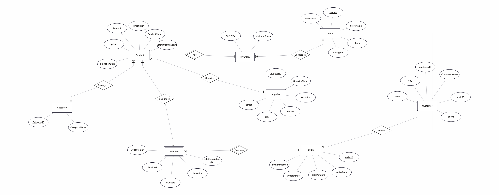
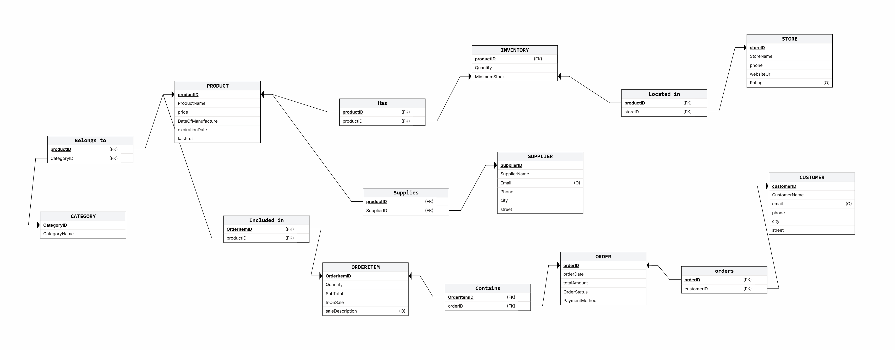

# Rami Levy: online store- Maayan Schwartz and Ravid Davidovich

### Project Overview: Rami Levy Online Store
As part of the semester project, we chose to focus on analyzing and defining the system of the **"Rami Levy Hashikma Marketing" online store**. The main objective is to examine the sales and logistics processes of the chain and propose technological and interface improvements that align with the needs of the modern market.

**During the first meeting, we completed the following steps:**
* **Data characterization:** We mapped the main entities in the system (such as customers, products, and orders) and formulated an initial **ERD** diagram that defines the database structure and the relationships between them.
* **Interface design:** We created initial sketches and designs for the system screens using **Google AI Studio**, with the goal of forming a clear visual concept and a convenient, efficient user experience for customers.

## First Screen

## Second Screen

## Third Screen

[Click here to view the screen designs in-Google AI Studio](https://ai.studio/apps/c41f5714-9418-42d2-864a-55b818c0d1db)