# Rami Levy Online Store

**Maayan Schwartz & Ravid Davidovich**

---

## Table of Contents

1. Project Overview  
2. System Description  
3. Screens Design  
4. Database Design (ERD & DSD)  
5. Data Types and Constraints  
6. Data Insertion Methods  
7. Data Volume  
8. Data Dictionary  
9. SQL Scripts  
10. Backup and Restore  
11. Conclusion  

---

## Project Overview

As part of the semester project, we designed and implemented a database system based on the Rami Levy Hashikma Marketing online store.

The goal of the project is to simulate a real-world supermarket system that manages customers, products, categories, suppliers, stores, orders, and inventory efficiently.

---

## System Description

The system supports the following main functionalities:

- Customer management  
- Product and category management  
- Supplier and store management  
- Order processing and tracking  
- Inventory management  
- Handling large-scale data  

---

## Screens Design

## First Screen


## Second Screen


## Third Screen


[Click here to view the screen designs in Google AI Studio](https://ai.studio/apps/c41f5714-9418-42d2-864a-55b818c0d1db)

---

## Data Insertion Methods Screenshots

### Manual Insert (SQL)


### Python Generated Data


### CSV Import Method


---

## Backup and Restore

### Database Backup


### Database Restore


The backup was created using pg_dump and restored using psql inside Docker.

---

## Database Design (ERD & DSD)

The system was designed using a Top-Down approach:

- System requirements definition  
- ERD creation  
- Conversion to DSD  
- Implementation in PostgreSQL  

The schema was checked and is normalized to at least Third Normal Form (3NF).

The final database includes the following entities:

- Customer  
- Category  
- Store  
- Supplier  
- Product  
- Orders  
- OrderItem  
- Inventory  

Relationships are implemented using Foreign Keys inside the tables.

---

## Data Types and Constraints

- VARCHAR – text fields  
- INT – identifiers and quantities  
- NUMERIC – prices and totals  
- DATE – date fields  

Constraints:

- Primary Keys  
- Foreign Keys  
- NOT NULL  

---

## Data Insertion Methods

### 1. Manual Insert
Used for inserting category data.

File:
DBProject/stage1/manualInsert/manual_insert.sql

---

### 2. Python Generated Data
Used to generate large datasets automatically.

Tables populated:

- customer (500)  
- store (500)  
- supplier (500)  
- inventory (500)  
- orders (20000)  
- orderitem (20000)  

Location:
DBProject/stage1/Programing/

---

### 3. CSV Import
Used for inserting product data using the COPY command.

File:
DBProject/stage1/DataImportFiles/products.csv

---

## Data Volume

- Minimum 500 records per table  
- 20,000 records in orders and orderitem  

---

## Data Dictionary

### Customer
- customerid – unique ID  
- customername – name  
- email – email  
- phone – phone  
- city – city  
- street – street  

### Category
- categoryid – unique ID  
- categoryname – category name  

### Store
- storeid – unique ID  
- storename – branch name  
- phone – phone  
- websiteurl – website  
- rating – rating  

### Supplier
- supplierid – unique ID  
- suppliername – name  
- email – email  
- phone – phone  
- city – city  
- street – street  

### Product
- productid – unique ID  
- productname – name  
- price – price  
- dateofmanufacture – production date  
- expirationdate – expiration date  
- kashrut – certification  
- categoryid – FK  
- supplierid – FK  

### Orders
- orderid – unique ID  
- orderdate – date  
- totalamount – total price  
- orderstatus – status  
- paymentmethod – payment type  
- customerid – FK  

### OrderItem
- orderitemid – unique ID  
- orderid – FK  
- productid – FK  
- quantity – quantity  
- subtotal – price  
- inonsale – boolean  
- saledescription – description  

### Inventory
- productid – FK  
- storeid – FK  
- quantity – stock  
- minimumstock – minimum stock  

---

## SQL Scripts

- createTables.sql  
- dropTables.sql  
- insertTables.sql  
- selectAll.sql  

---

## Conclusion of stage 1

This project demonstrates:

- Database design using ERD and DSD  
- Implementation in PostgreSQL  
- Data generation using multiple methods  
- Backup and restore processes  

The system is structured and simulates a real-world supermarket database.

# Project Report – Stage 2

## Stage 2: Queries, Constraints, Transactions and Indexes

---

## SELECT Queries (Dual Implementations)

### Query 1A – Using JOIN

השאילתה מחזירה לקוחות שביצעו הזמנות עם סכום גבוה מ-200 יחד עם פרטי ההזמנות שלהם.

SELECT c.customerid, c.customername, c.email,
       o.orderid, o.orderdate, o.totalamount
FROM customer c
JOIN orders o ON c.customerid = o.customerid
WHERE o.totalamount > 200;


---

### Query 1B – Using Subquery

השאילתה מחזירה את אותם לקוחות באמצעות תת-שאילתה המחזירה מזהי לקוחות.

SELECT c.customerid, c.customername, c.email
FROM customer c
WHERE c.customerid IN (
    SELECT customerid
    FROM orders
    WHERE totalamount > 200
);


Difference and Efficiency:
JOIN מבצע חיבור ישיר בין הטבלאות ולכן מאפשר ביצועים טובים יותר. Subquery יוצרת רשימה זמנית ולכן פחות יעילה.

---

### Query 2A – Using JOIN

השאילתה מחזירה מוצרים שמחירם מעל 50, כולל שם הספק ותאריך התפוגה מפורק לשנה ולחודש.


---

### Query 2B – Using Subquery

השאילתה מחזירה מוצרים שמחירם מעל 50 באמצעות EXISTS.


Difference and Efficiency:
השימוש ב־EXISTS כאן מיותר כי הוא בודק את אותה שורה ולכן עדיף להשתמש בתנאי WHERE פשוט ויעיל יותר
---

### Query 3A – Using JOIN

- חלבי השאילתה מחזירה ספקים והמוצרים שלהם לפי קטגוריה.

SELECT s.supplierid, s.suppliername,
       p.productid, p.productname,
       c.categoryname
FROM supplier s
JOIN product p ON s.supplierid = p.supplierid
JOIN category c ON p.categoryid = c.categoryid
WHERE c.categoryname = 'Dairy';


---

### Query 3B – Using Subquery

SELECT supplierid, suppliername
FROM supplier
WHERE supplierid IN (
    SELECT supplierid
    FROM product
    WHERE categoryid = (
        SELECT categoryid FROM category WHERE categoryname = 'Dairy'
    )
);


Difference and Efficiency:
JOIN יעיל יותר כי הוא מבצע חיבור ישיר בין כל הטבלאות. 
Subquery מקוננת מבצעת מספר שלבים ולכן פחות יעילה.

---

### Query 4A – Using EXTRACT

השאילתה מחזירה הזמנות לפי חודש ושנה.

SELECT *
FROM orders
WHERE EXTRACT(MONTH FROM orderdate) = 1
  AND EXTRACT(YEAR FROM orderdate) = 2025;


---

### Query 4B – Using BETWEEN

SELECT *
FROM orders
WHERE orderdate BETWEEN '2025-01-01' AND '2025-01-31';


Difference and Efficiency:
BETWEEN לרוב יעיל יותר כי מאפשר שימוש באינדקס,
בעוד EXTRACT מפעיל פונקציה ולכן עלול להיות פחות יעיל
---

## Additional SELECT Queries

### Query 5

השאילתה מחזירה מידע סטטיסטי על הזמנות באמצעות פונקציות חישוב.

SELECT ...


---

### Query 6

השאילתה מציגה מוצרים שנמכרו הכי הרבה יחד עם סכום ההכנסות.

SELECT ...


---

### Query 7

השאילתה מחזירה מוצרים שפג תוקפם או עומדים לפוג בקרוב.

SELECT ...


---

### Query 8

השאילתה מסכמת את מצב המלאי לפי חנויות.

SELECT ...


---

## DELETE Queries

השאילתות מבצעות מחיקה של נתונים לפי תנאים שונים.

### Delete 1

השאילתה מוחקת פריטים מטבלת orderitem לפי תנאי על מזהה הזמנה.


---

### Delete 2

השאילתה מוחקת פריטים עם כמות נמוכה.


---

### Delete 3

השאילתה מוחקת פריטים לפי תנאי נוסף.


---

## UPDATE Queries

השאילתות מעדכנות נתונים קיימים ומדגימות שינוי בערכים.

### Update 1

השאילתה מעדכנת מחירים של מוצרים.


---

### Update 2

השאילתה מעדכנת סטטוס הזמנות.


---

### Update 3

השאילתה מעדכנת דירוג חנויות לפי תנאים.


---

## Constraints

נוספו אילוצים לשמירה על תקינות הנתונים:
- מחיר מוצר חייב להיות חיובי
- כמות אינה יכולה להיות שלילית
- דירוג חנות בין 1 ל-5

ניסיונות להכניס נתונים לא תקינים גרמו לשגיאות, מה שמוכיח שהאילוצים נאכפים.


---

## ROLLBACK

בוצע עדכון זמני ולאחר מכן בוטל באמצעות ROLLBACK. ניתן לראות שהנתונים חזרו למצבם המקורי.


---

## COMMIT

בוצע עדכון ולאחר מכן COMMIT ששמר את השינוי לצמיתות.


---

## Indexes

נבדקו זמני ריצה לפני ואחרי יצירת אינדקסים.


Explanation:
לפני יצירת אינדקס בוצעה סריקה מלאה של הטבלה (Seq Scan).
לאחר יצירת האינדקס נעשה שימוש ב-Index Scan או Bitmap Index Scan.
זמן הריצה ירד משמעותית, ולכן האינדקסים שיפרו את ביצועי השאילתות.

---

## Summary

בשלב זה יושמו שאילתות מורכבות, פעולות עדכון ומחיקה, אילוצים, טרנזקציות ואינדקסים.
המערכת מדגימה שמירה על תקינות הנתונים ושיפור ביצועים באמצעות אופטימיזציה.


# Stage 3 - Database Integration


# Introduction

In this stage, we performed an integration between our original database system and an additional database system received from another team.

The goal of this stage was to create one combined database that preserves the important data and structure from both systems, while adapting the existing database according to the integrated ERD.

The integration was performed according to Method A, as required in class.

---

# Reverse Engineering Process

First, we received a backup file of another team's database.

Using the backup file, we analyzed the database structure and identified:

- Tables
- Columns
- Primary keys
- Foreign keys
- Constraints
- Relationships between tables

Based on this information, we created a DSD for the received database.

After that, we performed reverse engineering in order to reconstruct the ERD of the received system from the logical schema.

The reverse engineering process included:

1. Reading the table definitions from the backup file.
2. Identifying entities according to the main tables.
3. Identifying attributes according to the table columns.
4. Identifying primary keys.
5. Identifying foreign keys and using them to understand relationships.
6. Identifying many-to-many relationships through junction tables.
7. Creating an ERD that represents the received database.

---

# Branch Management DSD

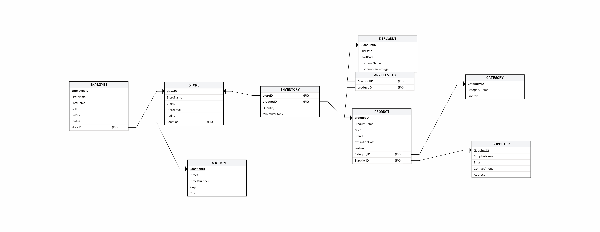

---

# Branch Management ERD

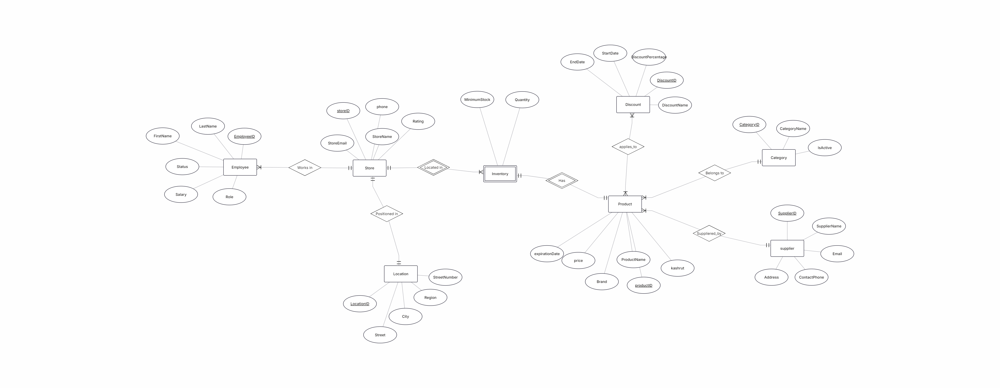

---

# Original and Received Systems

At this point, we had two separate ERD diagrams:

1. The original ERD of our system.
2. The ERD created from the received database backup.

Both systems described supermarket chain management, but there were differences in table names, attributes, and some entities.

For example, some tables represented similar entities, such as:

- `store` and `storeB`
- `product` and `productB`
- `inventory` and `inventoryB`
- `supplier` and `supplierB`

There were also tables that existed only in the received system, such as:

- `discount`
- `employee`
- `applies_to`
- `location`

---

# Combined ERD

After analyzing both systems, we created a combined ERD using ERDPlus.

During the integration process, we made design decisions regarding which entities should be merged, which attributes should be added, and which tables should remain as separate entities.

Main integration decisions:

- Similar tables were merged into one unified table.
- Attributes that appeared only in the received database were added to the existing tables when relevant.
- New entities that did not exist in our original system were added to the integrated schema.
- Temporary tables with the suffix `B` were used as source tables for the integration process.
- Unnecessary tables that were not included in the final integrated ERD were removed.

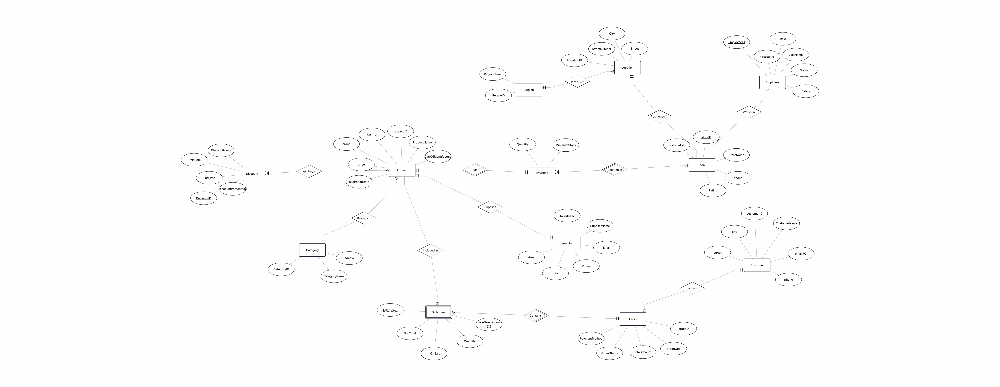

---

# Integrated DSD

After completing the integration process, we generated the final integrated DSD.

The integrated DSD represents the final logical structure of the combined database after all modifications and integrations were completed.

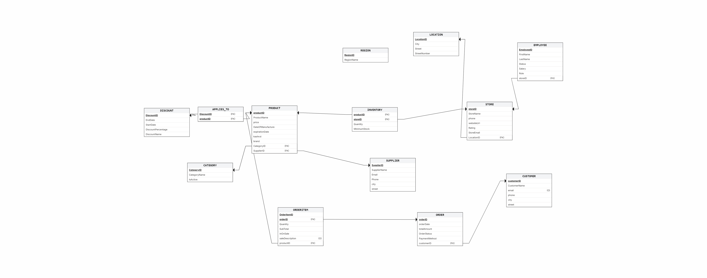

---

# Integrated Schema Creation

According to the instructions, we did not recreate the entire database from the beginning.

Instead, we used the existing database and changed it using SQL commands.

The integration was performed using the file:

Integrate.sql

## SQL Commands Used During Integration

During the integration process, we used several important SQL commands in 
order to modify the existing database structure without recreating the database from the beginning.

The main commands used in the integration process were:

### ALTER TABLE

Used to modify existing tables by:

* Adding new columns
* Removing unnecessary columns
* Updating the table structure according to the integrated ERD

Examples:

ALTER TABLE public.product
ADD COLUMN IF NOT EXISTS brand VARCHAR(50);

ALTER TABLE public.store
DROP COLUMN IF EXISTS storeemail;

This command was very important during the integration process because 
it allowed us to adapt the existing database structure to the new combined ERD without deleting and rebuilding the tables from the beginning.

---

### UPDATE

Used to update existing records with information received from the second system.

This allowed us to merge data from matching entities while preserving the existing rows.

Example:

UPDATE public.product p
SET brand = pb.brand
FROM public.productb pb
WHERE p.productid = pb.productid;

Using UPDATE commands helped us combine information from both systems
while avoiding duplication of existing records.

---

### INSERT INTO ... SELECT

Used to insert rows from the received database into the integrated database.

This command helped us move data between temporary integration tables and the final tables.

Example:

INSERT INTO public.inventory
(productid, storeid, quantity, minimumstock)

SELECT
ib.productid,
ib.storeid,
ib.quantity,
ib.minimumstock

FROM public.inventoryb ib;

This method allowed us to efficiently transfer large amounts of data from the temporary 
integration tables into the final integrated tables.

---

### CREATE TABLE IF NOT EXISTS

Used to create new tables that existed only in the received system and
were added to the integrated ERD.

Example:

CREATE TABLE IF NOT EXISTS public.location (
locationid integer PRIMARY KEY,
city character varying(100) NOT NULL,
street character varying(100) NOT NULL,
streetnumber integer NOT NULL
);

This command ensured that new entities from the second system could be integrated 
safely without causing errors if the table already existed.

---

### DROP TABLE IF EXISTS

Used to remove temporary tables that were only needed during the integration process.

Example:

DROP TABLE IF EXISTS public.suppliered_by CASCADE;

This helped clean the database after the integration process and remove tables 
that were not part of the final integrated ERD.

---

### Data Validation Queries

We also used validation queries in order to verify that all important tables 
contain data after the integration process.

Example:

SELECT COUNT(*) FROM public.product;

These checks helped ensure that the integration process was completed successfully 
and that the combined database remained consistent and functional.

Overall, the SQL integration process allowed us to successfully combine two different 
database systems into one integrated database while preserving important information from
both systems and maintaining database consistency.

# Views and Queries

During this stage, we created two meaningful database views, one from the perspective of our original system and one from the perspective of the received system.

The first view, `v_CustomerOrders`, represents the original system perspective. It combines customer data with order data in order to show customer purchases, payment methods, order dates, and total order amounts.

```sql
CREATE OR REPLACE VIEW v_CustomerOrders AS
SELECT 
    c.customerID,
    c.CustomerName,
    o.orderID,
    o.orderDate,
    o.PaymentMethod,
    o.totalAmount
FROM Customer c
JOIN Orders o
ON c.customerID = o.customerID;

To verify the view, we selected 10 rows from it:

SELECT *
FROM v_CustomerOrders
LIMIT 10;

Output:

 customerid | customername | orderid | orderdate  | paymentmethod | totalamount 
------------+--------------+---------+------------+---------------+-------------
          1 | Customer1    |       1 | 2025-01-01 | Credit Card   |      318.00
          2 | Customer2    |       2 | 2025-01-02 | Cash          |      116.00
          3 | Customer3    |       3 | 2025-01-03 | Bit           |      260.00
          4 | Customer4    |       4 | 2025-01-04 | PayPal        |      419.00
          5 | Customer5    |       5 | 2025-01-05 | Credit Card   |      257.00
          6 | Customer6    |       6 | 2025-01-06 | Cash          |      203.00
          7 | Customer7    |       7 | 2025-01-07 | Bit           |      302.00
          8 | Customer8    |       8 | 2025-01-08 | PayPal        |      129.00
          9 | Customer9    |       9 | 2025-01-09 | Credit Card   |      320.00
         10 | Customer10   |      10 | 2025-01-10 | Cash          |      209.00

For this view, we created two queries. The first query displays orders paid by credit card:

SELECT 
    CustomerName,
    orderID,
    totalAmount
FROM v_CustomerOrders
WHERE PaymentMethod = 'Credit Card'
LIMIT 10;

Output:

 customername | orderid | totalamount 
--------------+---------+-------------
 Customer1    |       1 |      318.00
 Customer5    |       5 |      257.00
 Customer9    |       9 |      320.00
 Customer13   |      13 |      158.00
 Customer17   |      17 |      395.00
 Customer21   |      21 |      496.00
 Customer25   |      25 |      134.00
 Customer29   |      29 |      233.00
 Customer33   |      33 |      273.00
 Customer37   |      37 |      491.00

The second query calculates the total amount spent by each customer:

SELECT 
    CustomerName,
    SUM(totalAmount) AS TotalSpent
FROM v_CustomerOrders
GROUP BY CustomerName
ORDER BY TotalSpent DESC
LIMIT 10;

Output:

 customername | totalspent 
--------------+------------
 Customer330  |   13054.00
 Customer410  |   12922.00
 Customer175  |   12594.00
 Customer332  |   12530.00
 Customer420  |   12514.00
 Customer51   |   12502.00
 Customer455  |   12317.00
 Customer435  |   12301.00
 Customer439  |   12276.00
 Customer180  |   12266.00

The second view, v_StoreInventory, represents the received branch management system perspective. It combines store, inventory, and product data in order to monitor product quantities and stock levels in each store.

CREATE OR REPLACE VIEW v_StoreInventory AS
SELECT 
    s.storeID,
    s.StoreName,
    p.productID,
    p.ProductName,
    i.Quantity,
    i.MinimumStock
FROM Store s
JOIN Inventory i
ON s.storeID = i.storeID
JOIN Product p
ON i.productID = p.productID;

To verify the view, we selected 10 rows from it:

SELECT *
FROM v_StoreInventory
LIMIT 10;

Output:

 storeid |            storename             | productid | productname | quantity | minimumstock 
---------+----------------------------------+-----------+-------------+----------+--------------
       1 | Rami Levy Jerusalem Branch 1     |         1 | Product1    |        2 |           10
       2 | Rami Levy Tel Aviv Branch 2      |         2 | Product2    |        4 |           10
       3 | Rami Levy Haifa Branch 3         |         3 | Product3    |        6 |           10
       4 | Rami Levy Rishon LeZion Branch 4 |         4 | Product4    |        8 |           10
       5 | Rami Levy Petah Tikva Branch 5   |         5 | Product5    |       10 |           10
       6 | Rami Levy Ashdod Branch 6        |         6 | Product6    |       12 |           10
       7 | Rami Levy Netanya Branch 7       |         7 | Product7    |       14 |           10
       8 | Rami Levy Beersheba Branch 8     |         8 | Product8    |       16 |           10
       9 | Rami Levy Holon Branch 9         |         9 | Product9    |       18 |           10
      10 | Rami Levy Rehovot Branch 10      |        10 | Product10   |       20 |           10

For this view, we created two queries. The first query identifies products that need restocking:

SELECT 
    StoreName,
    ProductName,
    Quantity,
    MinimumStock
FROM v_StoreInventory
WHERE Quantity <= MinimumStock
LIMIT 10;

Output:

            storename             | productname | quantity | minimumstock 
----------------------------------+-------------+----------+--------------
 Rami Levy Jerusalem Branch 1     | Product1    |        2 |           10
 Rami Levy Tel Aviv Branch 2      | Product2    |        4 |           10
 Rami Levy Haifa Branch 3         | Product3    |        6 |           10
 Rami Levy Rishon LeZion Branch 4 | Product4    |        8 |           10
 Rami Levy Petah Tikva Branch 5   | Product5    |       10 |           10

The second query calculates the total inventory quantity in each store:

SELECT 
    StoreName,
    SUM(Quantity) AS TotalItemsInStore
FROM v_StoreInventory
GROUP BY StoreName
LIMIT 10;

Output:

           storename            | totalitemsinstore 
--------------------------------+-------------------
 Rami Levy Tel Aviv Branch 462  |               924
 Rami Levy Netanya Branch 247   |               494
 Rami Levy Rehovot Branch 440   |               880
 Rami Levy Beersheba Branch 338 |               676
 Rami Levy Beersheba Branch 348 |               696
 Rami Levy Netanya Branch 277   |               554
 Rami Levy Holon Branch 409     |               818
 Rami Levy Holon Branch 389     |               778
 Rami Levy Ashdod Branch 76     |               152
 Rami Levy Rehovot Branch 240   |               480
# Stage 4 – PL/pgSQL Programming

---

## Introduction

In this stage, we implemented advanced PL/pgSQL programs on the integrated Rami Levy database.

The objective of this stage was to demonstrate procedural programming capabilities inside PostgreSQL using functions, procedures, triggers, loops, records, cursors, exception handling, and automatic database updates.

---

## Functions

### Function 1 – get_low_stock_products

This function returns a REF CURSOR containing products whose inventory quantity is lower than the minimum stock level.

**Programming elements used:**

- REF CURSOR
- JOIN
- Exception Handling
- RETURN CURSOR

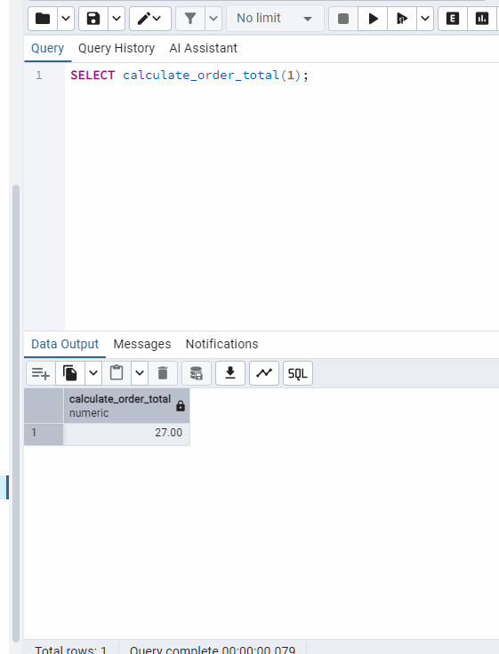

---

### Function 2 – calculate_order_total

This function calculates the total value of an order by iterating through all order items and summing their subtotal values.

**Programming elements used:**

- FOR LOOP
- RECORD
- Variables
- RETURN value
- Exception Handling

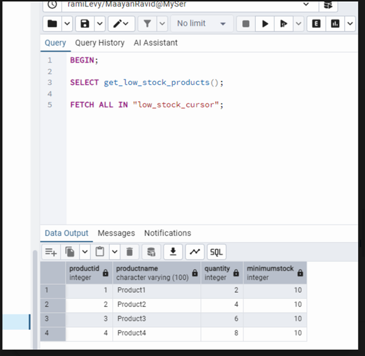

---

## Procedures

### Procedure 1 – restock_inventory

This procedure scans the inventory table and automatically updates products whose quantity is below the minimum stock level.

**Programming elements used:**

- FOR LOOP
- RECORD
- UPDATE statement
- Variables
- Exception Handling

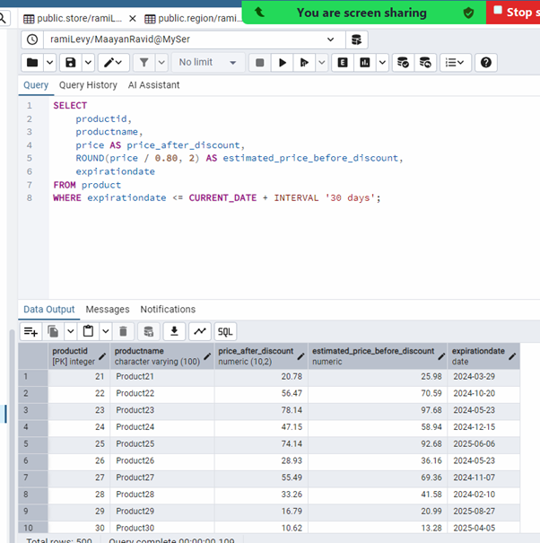

---

### Procedure 2 – update_expired_product_discount

This procedure applies a 20% discount to products that are close to their expiration date.

**Programming elements used:**

- FOR LOOP
- RECORD
- UPDATE statement
- Variables
- Exception Handling

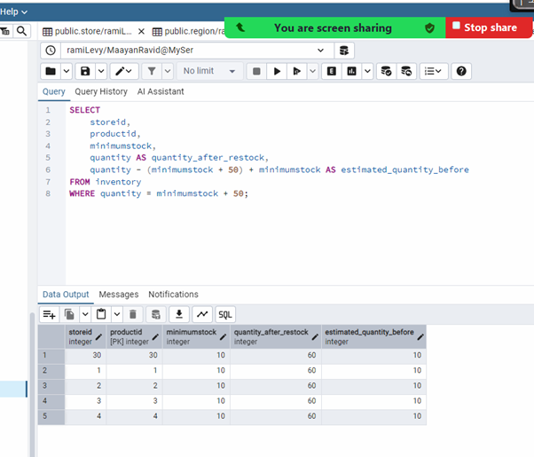

---

## Triggers

### Trigger 1 – Inventory Audit Trigger

This trigger is activated whenever the quantity of a product in the inventory table is updated.  
The trigger records the previous quantity and the new quantity in an audit table.

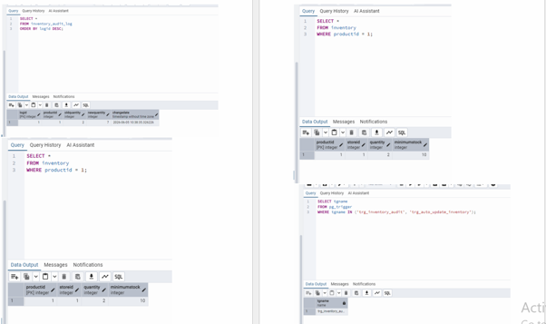

---

### Trigger 2 – Order Status Audit Trigger

This trigger is activated whenever an order status is modified.  
The trigger stores the previous status and the new status in a log table.

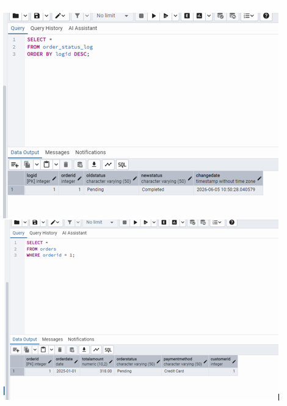

---

## Main Programs

### Main Program 1

This main program executes:

- restock_inventory()
- get_low_stock_products()

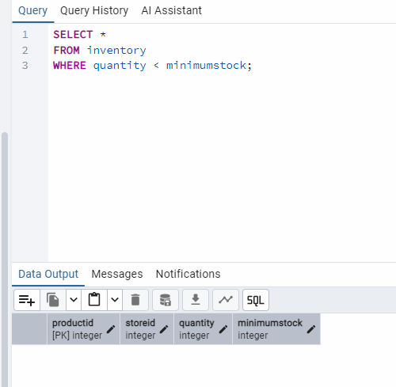

---

### Main Program 2

This main program executes:

- update_expired_product_discount()
- calculate_order_total()

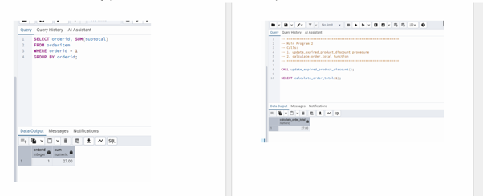

---

## Stage 4 Summary

In this stage, we successfully implemented procedural database programming using PL/pgSQL.

The implementation included:

- 2 Functions
- 2 Procedures
- 2 Triggers
- 2 Main Programs

The programs demonstrate the use of loops, records, cursors, exception handling, automatic updates, inventory management, discount calculation, auditing mechanisms, and order processing.