# Rami Levy Online Store

**Maayan Schwartz & Ravid Davidovich**

---

## Table of Contents

1. Project Overview  
2. System Description  
3. Screens Design  
4. Database Design (ERD & DSD)  
5. Data Types and Constraints  
6. Data Insertion Methods  
7. Data Volume  
8. Data Dictionary  
9. SQL Scripts  
10. Backup and Restore  
11. Conclusion  

---

## Project Overview

As part of the semester project, we designed and implemented a database system based on the Rami Levy Hashikma Marketing online store.

The goal of the project is to simulate a real-world supermarket system that manages customers, products, categories, suppliers, stores, orders, and inventory efficiently.

---

## System Description

The system supports the following main functionalities:

- Customer management  
- Product and category management  
- Supplier and store management  
- Order processing and tracking  
- Inventory management  
- Handling large-scale data  

---

## Screens Design

## First Screen

## Second Screen
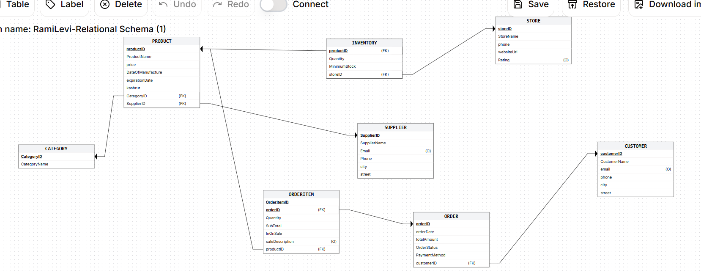

## Third Screen

[Click here to view the screen designs in Google AI Studio](https://ai.studio/apps/c41f5714-9418-42d2-864a-55b818c0d1db)

---

## Data Insertion Methods Screenshots

### Manual Insert (SQL)
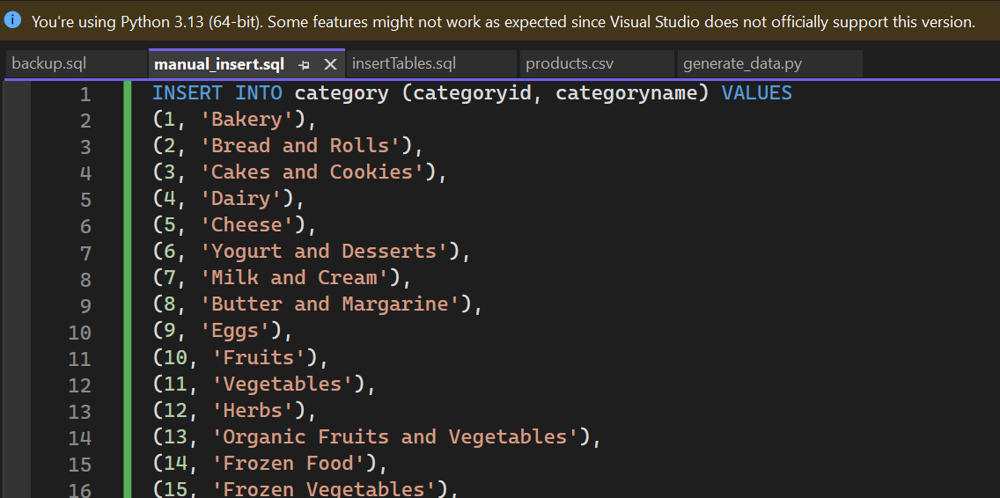

### Python Generated Data
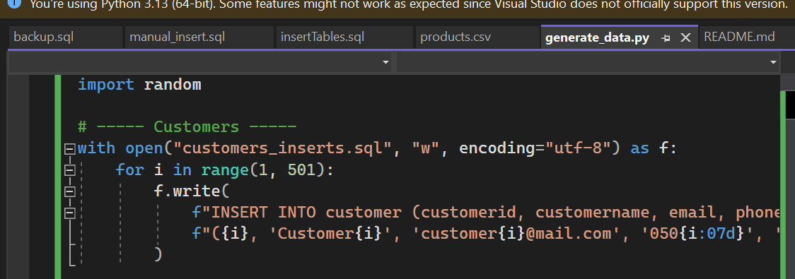

### CSV Import Method
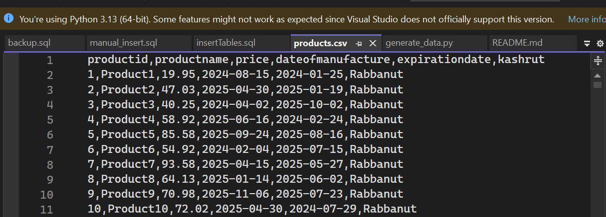

---

## Backup and Restore

### Database Backup
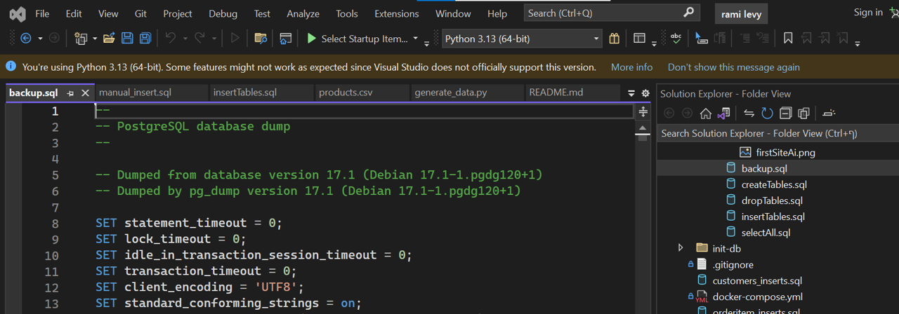

### Database Restore
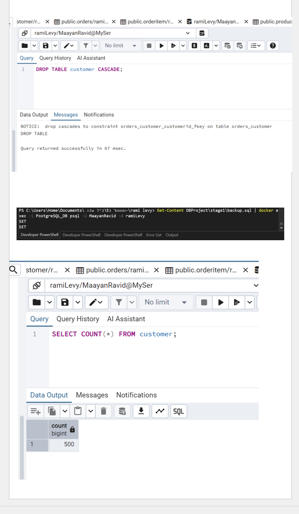

The backup was created using pg_dump and restored using psql inside Docker.

---

## Database Design (ERD & DSD)

The system was designed using a Top-Down approach:

- System requirements definition  
- ERD creation  
- Conversion to DSD  
- Implementation in PostgreSQL  

The schema was checked and is normalized to at least Third Normal Form (3NF).

The final database includes the following entities:

- Customer  
- Category  
- Store  
- Supplier  
- Product  
- Orders  
- OrderItem  
- Inventory  

Relationships are implemented using Foreign Keys inside the tables.

---

## Data Types and Constraints

- VARCHAR – text fields  
- INT – identifiers and quantities  
- NUMERIC – prices and totals  
- DATE – date fields  

Constraints:

- Primary Keys  
- Foreign Keys  
- NOT NULL  

---

## Data Insertion Methods

### 1. Manual Insert
Used for inserting category data.

File:
DBProject/stage1/manualInsert/manual_insert.sql

---

### 2. Python Generated Data
Used to generate large datasets automatically.

Tables populated:

- customer (500)  
- store (500)  
- supplier (500)  
- inventory (500)  
- orders (20000)  
- orderitem (20000)  

Location:
DBProject/stage1/Programing/

---

### 3. CSV Import
Used for inserting product data using the COPY command.

File:
DBProject/stage1/DataImportFiles/products.csv

---

## Data Volume

- Minimum 500 records per table  
- 20,000 records in orders and orderitem  

---

## Data Dictionary

### Customer
- customerid – unique ID  
- customername – name  
- email – email  
- phone – phone  
- city – city  
- street – street  

### Category
- categoryid – unique ID  
- categoryname – category name  

### Store
- storeid – unique ID  
- storename – branch name  
- phone – phone  
- websiteurl – website  
- rating – rating  

### Supplier
- supplierid – unique ID  
- suppliername – name  
- email – email  
- phone – phone  
- city – city  
- street – street  

### Product
- productid – unique ID  
- productname – name  
- price – price  
- dateofmanufacture – production date  
- expirationdate – expiration date  
- kashrut – certification  
- categoryid – FK  
- supplierid – FK  

### Orders
- orderid – unique ID  
- orderdate – date  
- totalamount – total price  
- orderstatus – status  
- paymentmethod – payment type  
- customerid – FK  

### OrderItem
- orderitemid – unique ID  
- orderid – FK  
- productid – FK  
- quantity – quantity  
- subtotal – price  
- inonsale – boolean  
- saledescription – description  

### Inventory
- productid – FK  
- storeid – FK  
- quantity – stock  
- minimumstock – minimum stock  

---

## SQL Scripts

- createTables.sql  
- dropTables.sql  
- insertTables.sql  
- selectAll.sql  

---

## Conclusion of stage 1

This project demonstrates:

- Database design using ERD and DSD  
- Implementation in PostgreSQL  
- Data generation using multiple methods  
- Backup and restore processes  

The system is structured and simulates a real-world supermarket database.

# Project Report – Stage 2

## Stage 2: Queries, Constraints, Transactions and Indexes

---

## SELECT Queries (Dual Implementations)

### Query 1A – Using JOIN

השאילתה מחזירה לקוחות שביצעו הזמנות עם סכום גבוה מ-200 יחד עם פרטי ההזמנות שלהם.

SELECT c.customerid, c.customername, c.email,
       o.orderid, o.orderdate, o.totalamount
FROM customer c
JOIN orders o ON c.customerid = o.customerid
WHERE o.totalamount > 200;

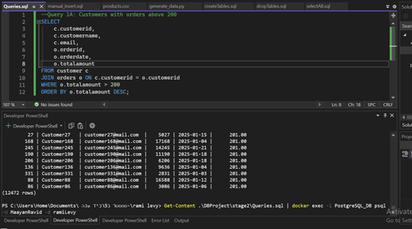

---

### Query 1B – Using Subquery

השאילתה מחזירה את אותם לקוחות באמצעות תת-שאילתה המחזירה מזהי לקוחות.

SELECT c.customerid, c.customername, c.email
FROM customer c
WHERE c.customerid IN (
    SELECT customerid
    FROM orders
    WHERE totalamount > 200
);

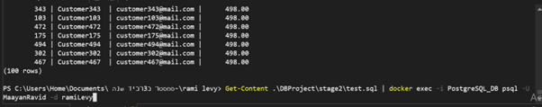

Difference and Efficiency:
JOIN מבצע חיבור ישיר בין הטבלאות ולכן מאפשר ביצועים טובים יותר. Subquery יוצרת רשימה זמנית ולכן פחות יעילה.

---

### Query 2A – Using JOIN

השאילתה מחזירה מוצרים שמחירם מעל 50, כולל שם הספק ותאריך התפוגה מפורק לשנה ולחודש.

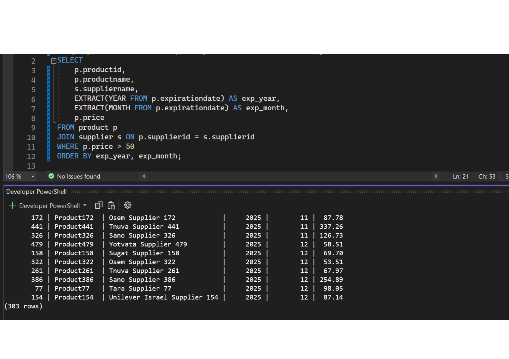

---

### Query 2B – Using Subquery

השאילתה מחזירה מוצרים שמחירם מעל 50 באמצעות EXISTS.

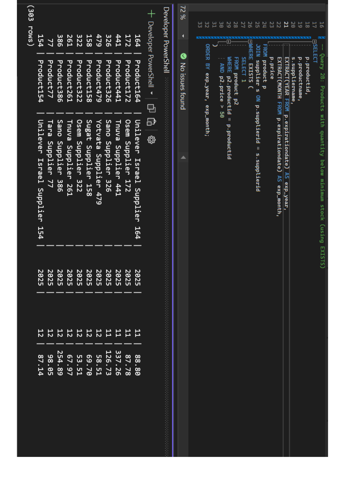

Difference and Efficiency:
השימוש ב־EXISTS כאן מיותר כי הוא בודק את אותה שורה ולכן עדיף להשתמש בתנאי WHERE פשוט ויעיל יותר
---

### Query 3A – Using JOIN

- חלבי השאילתה מחזירה ספקים והמוצרים שלהם לפי קטגוריה.

SELECT s.supplierid, s.suppliername,
       p.productid, p.productname,
       c.categoryname
FROM supplier s
JOIN product p ON s.supplierid = p.supplierid
JOIN category c ON p.categoryid = c.categoryid
WHERE c.categoryname = 'Dairy';

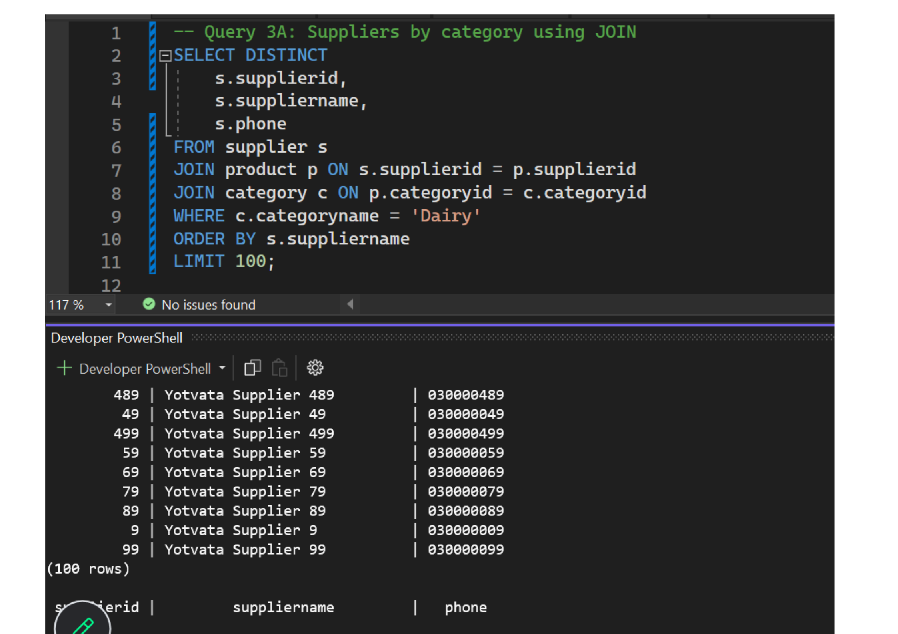

---

### Query 3B – Using Subquery

SELECT supplierid, suppliername
FROM supplier
WHERE supplierid IN (
    SELECT supplierid
    FROM product
    WHERE categoryid = (
        SELECT categoryid FROM category WHERE categoryname = 'Dairy'
    )
);

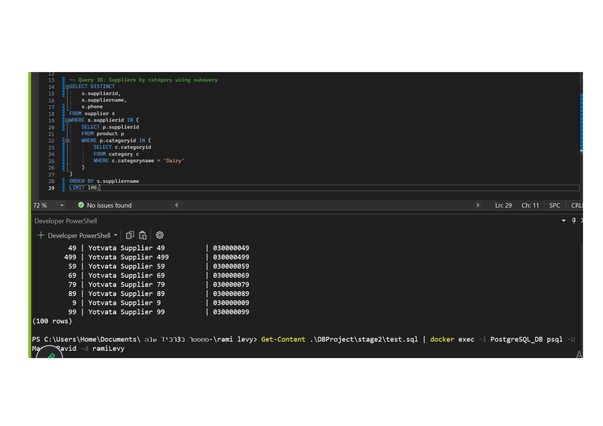

Difference and Efficiency:
JOIN יעיל יותר כי הוא מבצע חיבור ישיר בין כל הטבלאות. 
Subquery מקוננת מבצעת מספר שלבים ולכן פחות יעילה.

---

### Query 4A – Using EXTRACT

השאילתה מחזירה הזמנות לפי חודש ושנה.

SELECT *
FROM orders
WHERE EXTRACT(MONTH FROM orderdate) = 1
  AND EXTRACT(YEAR FROM orderdate) = 2025;

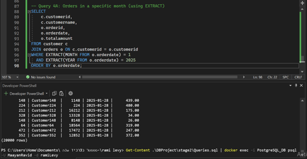

---

### Query 4B – Using BETWEEN

SELECT *
FROM orders
WHERE orderdate BETWEEN '2025-01-01' AND '2025-01-31';

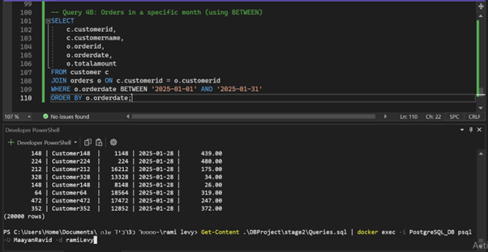

Difference and Efficiency:
BETWEEN לרוב יעיל יותר כי מאפשר שימוש באינדקס,
בעוד EXTRACT מפעיל פונקציה ולכן עלול להיות פחות יעיל
---

## Additional SELECT Queries

### Query 5

השאילתה מחזירה מידע סטטיסטי על הזמנות באמצעות פונקציות חישוב.

SELECT ...

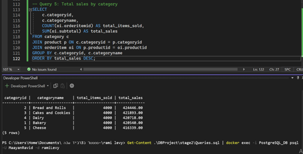

---

### Query 6

השאילתה מציגה מוצרים שנמכרו הכי הרבה יחד עם סכום ההכנסות.

SELECT ...

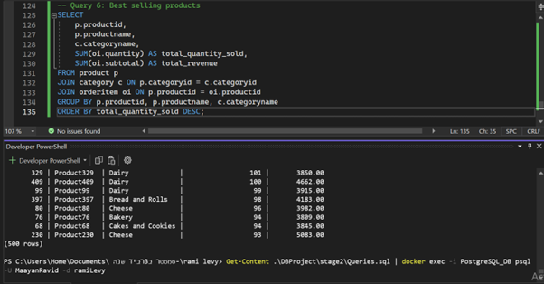

---

### Query 7

השאילתה מחזירה מוצרים שפג תוקפם או עומדים לפוג בקרוב.

SELECT ...

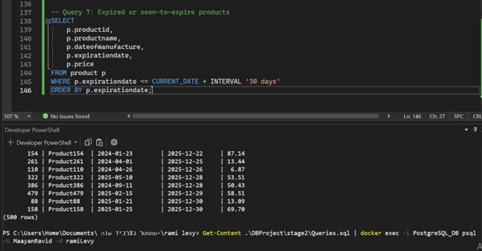

---

### Query 8

השאילתה מסכמת את מצב המלאי לפי חנויות.

SELECT ...

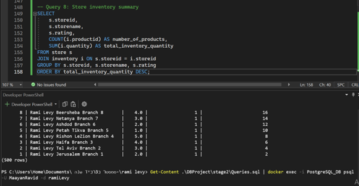

---

## DELETE Queries

השאילתות מבצעות מחיקה של נתונים לפי תנאים שונים.

### Delete 1

השאילתה מוחקת פריטים מטבלת orderitem לפי תנאי על מזהה הזמנה.

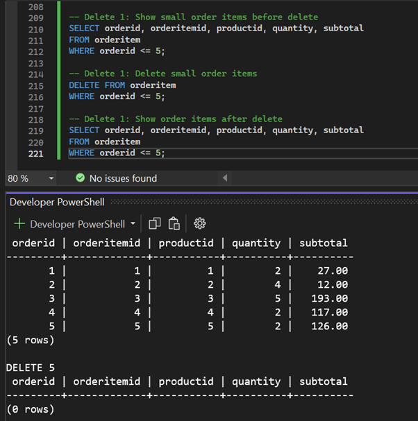

---

### Delete 2

השאילתה מוחקת פריטים עם כמות נמוכה.

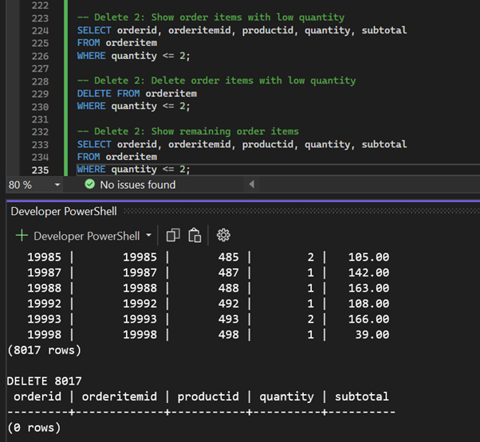

---

### Delete 3

השאילתה מוחקת פריטים לפי תנאי נוסף.

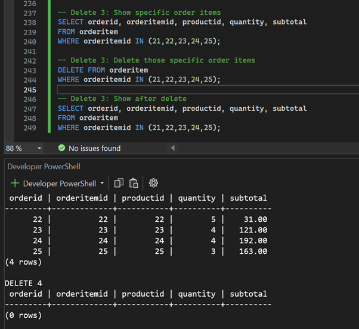

---

## UPDATE Queries

השאילתות מעדכנות נתונים קיימים ומדגימות שינוי בערכים.

### Update 1

השאילתה מעדכנת מחירים של מוצרים.

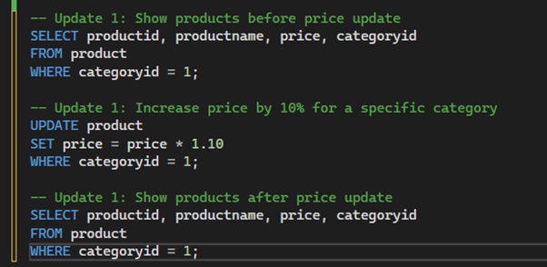

---

### Update 2

השאילתה מעדכנת סטטוס הזמנות.

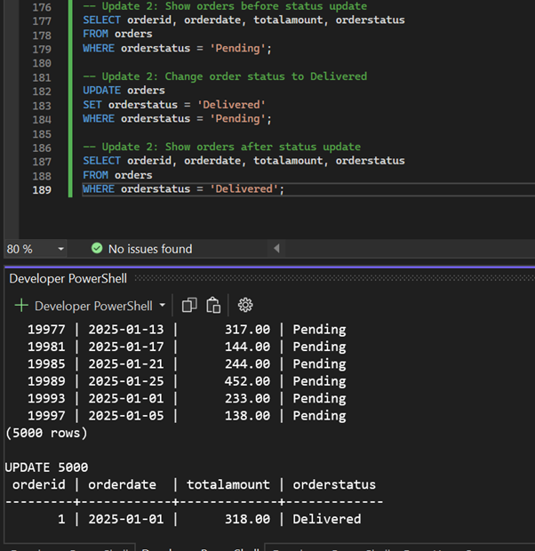

---

### Update 3

השאילתה מעדכנת דירוג חנויות לפי תנאים.

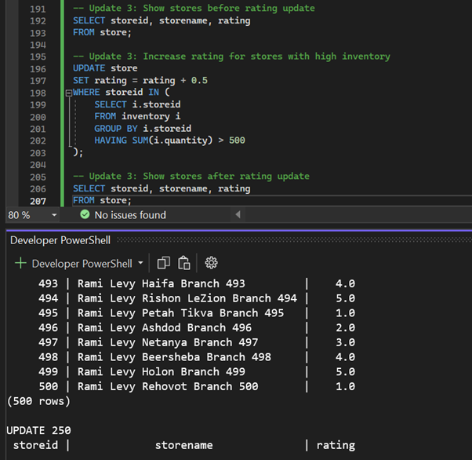

---

## Constraints

נוספו אילוצים לשמירה על תקינות הנתונים:
- מחיר מוצר חייב להיות חיובי
- כמות אינה יכולה להיות שלילית
- דירוג חנות בין 1 ל-5

ניסיונות להכניס נתונים לא תקינים גרמו לשגיאות, מה שמוכיח שהאילוצים נאכפים.

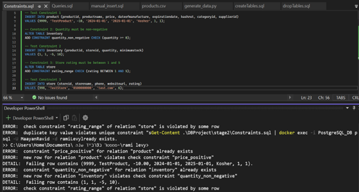

---

## ROLLBACK

בוצע עדכון זמני ולאחר מכן בוטל באמצעות ROLLBACK. ניתן לראות שהנתונים חזרו למצבם המקורי.

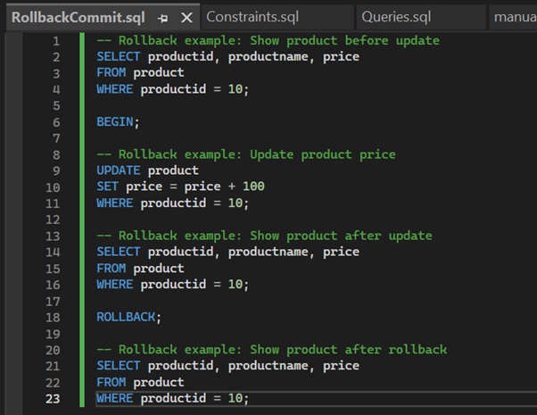
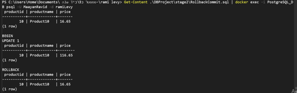

---

## COMMIT

בוצע עדכון ולאחר מכן COMMIT ששמר את השינוי לצמיתות.

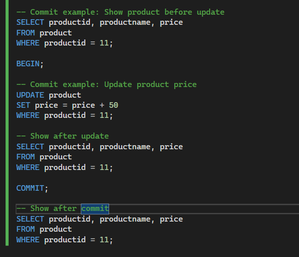
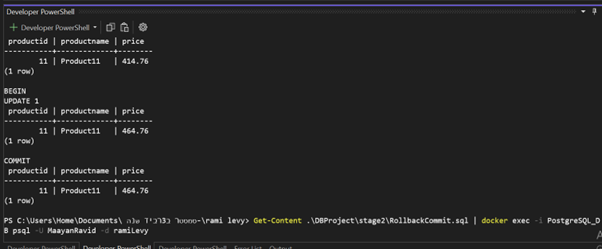

---

## Indexes

נבדקו זמני ריצה לפני ואחרי יצירת אינדקסים.

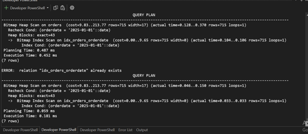
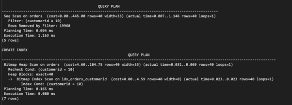
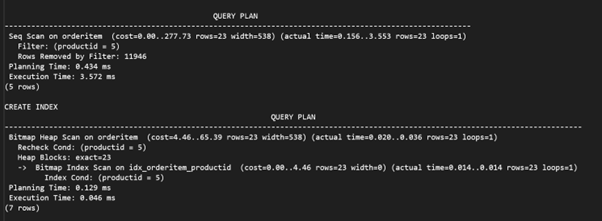

Explanation:
לפני יצירת אינדקס בוצעה סריקה מלאה של הטבלה (Seq Scan).
לאחר יצירת האינדקס נעשה שימוש ב-Index Scan או Bitmap Index Scan.
זמן הריצה ירד משמעותית, ולכן האינדקסים שיפרו את ביצועי השאילתות.

---

## Summary

בשלב זה יושמו שאילתות מורכבות, פעולות עדכון ומחיקה, אילוצים, טרנזקציות ואינדקסים.
המערכת מדגימה שמירה על תקינות הנתונים ושיפור ביצועים באמצעות אופטימיזציה.